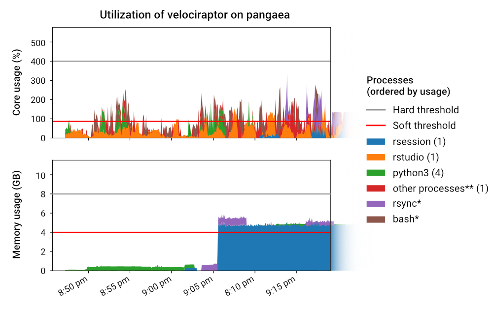
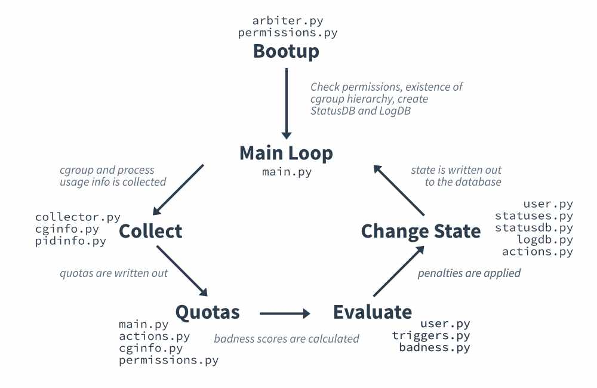

# Arbiter2's Internal Architecture

_By Dylan Gardner, 03/03/2021_

This document aims to summarize how Arbiter2 works internally. Please see [SYNCHRONIZATION.md](SYNCHRONIZATION.md) for details on Arbiter2's cross-node synchronization algorithm and [CGROUPS.md](CGROUPS.md) for some more technical details and background on Linux cgroups. For a conceptual overview of Arbiter2, you can read the [Arbiter paper](https://dylngg.github.io/resources/arbiterTechPaper.pdf).

## Components

Arbiter2's core purpose is to evaluate users' impact on a login node over a period of time and penalize a user for a defined period of time if that impact is significant. This involves several components that can be split into the following groupings:

1. [Process and cgroup usage collection](#process-and-cgroup-usage-collection)

2. [Scoring of users based on usage](#scoring-of-users-based-on-usage)

3. [Tracking of user states](#tracking-of-user-states)

4. [Ensuring the relevant quotas are set](#ensuring-the-relevant-quotas-are-set)

5. [Sending emails to users and admins](#sending-emails-to-users-and-admins)

6. [Keeping track of actions for later analysis](#keeping-track-of-actions-for-later-analysis)

7. [Synchronization of user states across hosts (optional)](#synchronization-of-user-states-across-hosts-optional)

### 1. Process and cgroup usage collection

This involves polling the `/proc` and cgroup virtual filesystem `/sys/fs/cgroup` for the user's corresponding CPU and memory cgroup usage as well as the CPU and memory usage of processes within that cgroup. Care must be taken with these actions to ensure both process and cgroup race conditions (e.g. a user logging out or a process disappearing) don't lead to adverse effects operationally and numerically. The number of processes existing on the machine also presents a challenge from an efficiency perspective.

### Data Collected

Arbiter2 collects two different types of statistics about a user: general per-user cgroup statistics, and per-process statistics. Arbiter2 does not collect statistics about _every_ process on a node, but rather it collects statistics about processes in the user's cgroup. For each user, Arbiter2 uses the `cgroup.procs` file in their cgroup (specifically, within the `systemd` "controller") to determine which processes the user is running and then polls the CPU and memory usage of those corresponding processes.

#### cgroup statistics

Arbiter2 utilizes the `cpuacct` and `memory` v1 cgroup controllers to obtain statistics about a user's CPU and memory usage. cgroup controllers are typically mounted at `/sys/fs/cgroup` (I'm not sure if this is hardcoded in systemd). The `cgroup` logic in Arbiter2 is mostly stored in `cginfo.py` It should be noted that technically, `cpu` and `cpuacct` are different controllers. One permits control of CPU shares (scheduling) of the set of processes, and the other simply accounts on the usage of a set of processes. On CentOS and Debian-based systems (e.g. Ubuntu), these are mounted together as `cpu,cpuacct`.

From the `memory` and `cpuacct` controllers, Arbiter2 collects the "real" memory usage of a user (similar to RSS in `/proc/pid/status` and found in `ps`), as well as the user and system CPU time of a user. The CPU times are later turned into a usage percentage. [A question on StackOverflow](https://unix.stackexchange.com/questions/450748/calculating-cpu-usage-of-a-cgroup-over-a-period-of-time) provides details on how the CPU times are turned into percentages.

Note that in order to get the "real" memory usage, the `memory.stat` file in the memory controller is used. More specifically, the `total_rss` and `total_mapped_file` values are used \*. The more convenient and appropriate-looking `memory.usage_in_bytes` file is _not_ used, since the memory usage reported in that file includes memory caching done by the kernel \*\*. Kernel docs also report that the `memory.usage_in_bytes` file is also a "fuzz value for efficient access". This is of note because historically Arbiter2 has used this file and attempted to subtract out kernel memory from the `memory.kmem.usage_in_bytes` file. On RHEL/CentOS 7 machines, this file is empty due to a kernel bug, resulting in the now-deprecated `--rhel7-compat` flag which caused Arbiter2 to throw away cgroup memory information and replace it with the sum of the processes memory of the cgroup.

_\*here, the RSS in `total_rss` does not have the same meaning as RSS reported for processes; RSS here does not include file-backed memory._

_\*\*in fact, systemd incorrectly (or on purpose?) uses this file and reports the tainted memory usage when you do `systemctl status ...`_

#### Process statistics

Arbiter2 uses the `/proc` virtual filesystem to poll statistics about processes, such as the process name, CPU time, memory and UID of the process. This can be found in the `pidinfo.py` file.

##### Memory

Of note is the type of memory usage collected by Arbiter2. When it comes to memory measurements of a process, several measurements are provided by the kernel: primarily `VmRSS` (in `/proc/pid/status`), `VmSize` (in `/proc/pid/status`) and `PSS` (in `/proc/pid/smaps_rollup` or `smaps` for older kernels). The former is what is used by programs such as `ps`; this includes shared, file-backed and anonymous memory. The middle is the total _virtual_ memory of the process; this is not reflective of the actually physical memory reserved to the process. The latter is essentially RSS, in that it includes file-backed and anonymous memory but with a twist: the shared memory reported in that number is a proportional fractional of total shared memory, the proportion corresponding to the number of consumers of each shared memory allocation. What this means is that when summing the memory of processes, PSS doesn't over count shared memory, whereas RSS does. RSS is the default memory accounting mechanism, with PSS being optional. Having an accurate sum of memory usage is important when it comes to using Arbiter2 with the `--rhel7-compat` flag, since the memory usage counted against users is based on the sum of process memory, rather than cgroup memory (see [cgroup statistics](#cgroup-statistics) for details).

#### Process and cgroup Race Conditions

One specific consideration when implementing the collection of process and cgroup data is the avoidance of identifier race conditions, wherein the program holds an assumption about whether a process or cgroup not only exists at a current moment in time but also that the process or cgroup identifier earlier is the same as one found now.

For example, the CPU usage of a process and a cgroup is calculated by comparing the CPU time between two instances at two points in time. If a process or a cgroup goes away after the first CPU time is collected, but the program doesn't properly deal with the possible operational failure of obtaining the second CPU time or assumes the existence of a second CPU time in it's calculation, then operational or numeric errors will occur.

Furthermore, given the diversity of user workloads on login nodes, it is also not necessarily safe to assume that a process identifier (PID) uniquely identifies a particular process over long polling times\*. PIDs on Linux increase monotonically up to a limit and wrap around to the lowest unused number when this limit is encountered. Herein lies the problem. If a process' CPU time is polled by a program in one particular moment and the PID counter wraps around to the same PID due to rapid process forking before the next poll, then when the program polls that same PID, the process may be different and the CPU time reset, leading to erroneous CPU usage\*\*. Arbiter2's present solution to this is to compare the two CPU times of a PID (which is monotonic for the lifetime of a process) before calculating the CPU usage of a process. If the second time is less than the first, it can be reasonably inferred that a process race condition has occurred. This consideration and solution is also applied to cgroups: if a user logs in and out between polls, then the resetting of CPU time in the cgroup will also cause erroneous CPU usage.

It should also be noted that as a fail safe for numeric errors, the `cfg.badness.cap_badness_incr` can be enabled to cap the per-interval badness increase to the maximum increase permitted by a user's quota. This does have the unfortunate side-effect of masking numerical bugs.

_\*This is a strong suspicion based on a number of historical Arbiter2 emails containing impossible process CPU usage years ago; I have seen no more of these since the fix detailed above was put in place. It also makes sense with some napkin math. Let's assume you are on `notchpeak1`, which has 32 cores, and there are ~4,000 processes, mostly unattended shells. Let's also say the PID limit is 16,384 (not true now at CHPC, but true when Arbiter2 was first developed) and you have 8 users all compiling with `make -j4`. Compiler processes won't stay around for that long, but it will increase the PID counter. If each of those users are spawning off 32 processes/sec, then within 30s---CHPC's old configured poll period---7,680 processes will have been spawned. With that, `7,680 + 4,000 = 11,680`, which is uncomfortably close to the process limit. Throw in some more users doing scripting and there's although it'd be extremely rare, it's plausible that you could see PIDs wrap around entirely within the poll interval at some point._

_\*\*This example assumes that the opened file in the `/proc` filesystem is closed after the first poll and reopened in the second poll. If it was kept open, a further read after the process disappeared would return an error, even if the PID is reassigned. Interestingly enough, this race condition is also a concern for security-sensitive applications. The solution to those cases is to [hold onto file descriptors](https://lwn.net/Articles/801319/) that enable applications to track processes beyond a process' lifetime. That being said, Arbiter2 does not keep these files open due to there being thousands of processes and multiple files needing to be read per process. This makes the code to keep track of file descriptors tricky to implement correctly without leaks---at least from the primary author's perspective---and as such, it has not been successfully implemented in Arbiter2 yet._

### 2. Scoring of users based on usage

See the [Arbiter2 paper for details on how the badness score works](https://dylngg.github.io/resources/arbiterTechPaper.pdf). Internally, Arbiter2 stores badness scores in a custom `badness.Badness()` object. This object is mutable and recalculates a new score when usage information is given.

The usage numbers given to the badness algorithm is based on the user's cgroup usage, minus any whitelisted usage summed from the per-process information. What constitutes "whitelisted" is based on two things: the global whitelist and a per-status group whitelist. The process names (note: this is _not_ the argv cmdline, but rather the first 15 bytes of the actual executable name on file) are compared directly to the names found in each whitelist. The exception to this is the optional notion of "other processes**" which when enabled in the config results in a fake process with the usage of that process being the difference between cgroup and the sum of processes. The addition of this process effectively requires Arbiter2 to fully account for all "bad" usage before callings someone out. The whitelisting logic is in `user.py`.

### 3. Tracking of user states

To keep track of the state of users, Arbiter2 has a `user.User()` class that contains other helper objects that store the badness of the user (`badness.Badness()`), cgroup utility `cginfo.UserSlice()`, and the status or state of the user (`statuses.Status()`). Updates to the user state happen through this object (or should). This object is then used in modules such as `actions.py` to obtain information for violation emails.

#### StatusDB

To keep penalties and badness scores across restarts or failures, Arbiter2 writes out the current status/state of the user to a database internally called StatusDB. This database is either a local sqlite3 database called statuses.db, and kept at `cfg.database.log_location`, or is a remote networked database such as MySQL or PostgreSQL. In the latter case, the database is configured with the `cfg.database.statusdb_url`. See the [CONFIG.md](CONFIG.md) for details on that database from a configuration standpoint.

The code for updating StatusDB is found in the `statusdb.py` file, and the state of the user is found in `statuses.py`.

There are two schemas associated with StatusDB. One is called v1, and this was used up until Arbiter2 v2. The other, v2, is now the default schema. Arbiter2 can read and use both schemas for backwards compatibility reasons, specifically so that old `statuses.db` files can be read and used for testing purposes. When a networked database is used, the v2 schema is required since the v2 schema contains additional columns used for synchronization.

The primary difference between the schemas is the addition of a `hostname` column in both the badness and status tables, which allows different Arbiter2 instances to share the same database.

See [SYNCHRONIZATION.md](SYNCHRONIZATION.md) for details on synchronization.

### 4. Ensuring the relevant quotas are set

On every interval, Arbiter2 will check each user's cgroup for whether their appropriate quota is set. If it is not, it will first set the right permissions on the cgroup hierarchy (if needed) to allow for the unprivileged user to write out a quota.

Since users may log in and out at any time and quotas are only persistent for the lifetime of a cgroup, Arbiter2 has to check for quotas on each interval. Upon logout systemd will remove a cgroup.

#### Sudoers

If Arbiter2 is ran as an unprivileged user, as recommended in the INSTALL.md guide, Arbiter2 will require the use of `sudo` to `chown` itself permission to write cgroup quotas. The use of `sudo` is indicated with the `-s` flag. The [INSTALL.md](INSTALL.md) documents how to modify `/etc/sudoers` or `/etc/sudoers.d/` to permit the user Arbiter2 is running under to modify the cgroup hierarchy. The code to write out permissions can be found in `permissions`.

If Arbiter2 is ran as root, no flag is required and Arbiter2 will not attempt to use `sudo`.

### 5. Sending emails to users and admins

When a violation occurs, or a user violation expires, an email is sent to users with the email BCC'd to admins. The administrator emails are hardcoded in the configuration, specifically `cfg.email.admin_emails`. For the user emails, the email address used is provided by the `get_user_metadata()` function in the site-specific `integrations.py` module. The `etc/integrations.py` Python module  can be modified to customize the emails sent to users. For CHPC,the `get_user_metadata()` function does a lookup to a web service for email addresses, but falls back to the standard `uNID@umail.utah.edu` address if that fails. The actual emailing code can be found in `actions.py`.

**Note:** Any breaking changes to `integrations.py` should be documented and called out in the public upgrade notes. There are a number of improvements that _could_ be made, such as removing the use of the supposedly internal `user.User()` object in `overall_high_usage_body` and cleaning up the function parameters, but since other sites are relying on this current interface (and we'd like to make it easy for sites to upgrade), breaking the interface has not been done and will likely not be done without a very good reason, as least by the primary author\*.

A key part of the email sent to users is a plot of their usage. This plot is generated using `matplotlib` and the code can be found in `plots.py` and `actions.py`. The code itself is fairly ugly since it has to deal with the fact that each poll can contain a completely different set of processes than the previous one, and processes with the same name need to be combined. Furthermore, the code does _weird things<sup>TM</sup>_ with the scaling of process usage since the number of processes shown is capped (`cfg.email.plot_process_cap`) to keep the legend sensible, but the plot _should_ still make it clear to the user that they are in violation. To _weird thing<sup>TM</sup>_ the code does to deal with this is that it scales the usage of each process equally to fit the usage found in the user's cgroup, since that usage is accurate. Processes are shown in the plot to provide context on _what_ the user was doing to be in violation. Usually, the plot makes it crystal clear why, since the necessary averaging done in the emailed processes table can sometimes make it look like the user didn't violate the policy.



_\*The only interface break has been on the upgrade from v1.4.4 to v2.0.0; An additional parameter was added to `integrations.warning_email_body()` to provide the set of hostnames that this particular Arbiter2 instance is syncing with._

### 6. Keeping track of actions for later analysis

When a violation occurs, or a high usage warning is triggered, Arbiter2 will log out the history of process and cgroup usage information for the affected user(s) to a local sqlite3 database called LogDB. This filename is `log.db`, and this log is rotated by default weekly, though this is configurable with `cfg.database.log_rotate_period`. The code to handle this is stored in the  `logdb.py` file.

The reason for this database is so that both administrators and developers can examine the full usage history that led to the user being called out by a violation. When a high usage warning is triggered, the entire history of all users is not written out, but rather a 8 history points of each user.

This database is used for reports such as `tools/arbreport.py` and `tools/arbprocreport.py`.

### 7. Synchronization of user states across hosts (optional)

See [SYNCHRONIZATION.md](SYNCHRONIZATION.md).

## Flow Diagram



Arbiter2 is started by running `arbiter.py`. This file parses command line actions and bootstraps the runtime (e.g. adding the configured `--etc` directory to it's path, `chown`ing the cgroup hierarchy so it can write quotas, etc).

From there, `main.run()` is called and Arbiter enters the main loop, which collect information about users, set quotas, evaluate users, and finally penalizes users. The diagram above shows this and the relevant files for each part. Note that there are additional helper files used beyond those shown.

## Startup

### Arbiter2 Bootstrapping

The file used to start Arbiter2 is `arbiter.py`. This file first does some sanity checks such as looking for the cgroup hierarchy and making sure that accounting is on, before running `main.run()`.

In addition to these sanity checks, the `arbiter.py` file must also load the configuration list and also add the optionally provided `etc/` directory to the internal Python `sys.path` so that `etc/integrations.py` can be loaded.

To load the configuration list, the `cfgparser.load_config(*config_files)` function is called. `cfgparser` contains a global `cfg` object that is used in most of the Arbiter2 module files, so this function loads that object up with the configuration. Note that the configuration itself is also checked for validity in `cfgparser.py`. This is to either warn administrators about suspicious values or incorrect values so that Arbiter2 doesn't fail in weird ways later when it is running.

### enabling per-user cgroup accounting

When operating, Arbiter2 requires that the `cpu`, `cpuacct` and `memory` controllers exist and are populated with `user-$UID.slice` cgroups from systemd. Ensuring this precondition on older systemd versions (e.g. on CentOS 7) is more complex than it should be.

The procedure for enabling accounting partially described in [INSTALL.md](INSTALL.md), though an overview is provided here.

On newer systemd versions (something like `v240` or above), the way to do this is by creating a configuration file in `/etc/systemd/user/` that tells systemd to enable CPU and memory accounting for users. That is sufficient and accounting will stay on, regardless of whether the machine is rebooted or if all users log out.

On older systemd versions, such as found on CentOS 7, there is no persistent mechanism in systemd to enable CPU and memory accounting. Instead, there are a couple of hacks that administrators can use to achieve the same thing. All of these hacks rely on an implicit cgroup rule that systemd enforces: if accounting is enabled for a particular unit, it must be enabled for all other units on the same level and their parents. For example, if accounting is enabled for some `user-1000.slice`, then all other `user-$UID.slice` units must also have accounting enabled, in addition to `user.slice`.

There are two clever hacks with Arbiter2 that utilize the logic above to ensure that cgroup accounting for users is always enabled:

1. Modify the `arbiter2.service` file to run as a non-root user, then put the systemd unit in the user slice cgroup via the `Slice=user-$ARBUID.slice` setting and enable accounting via additional `CPUAccounting=true` and `MemoryAccounting=true` settings. This is done in the `arbiter2.service` file provided in the repo.

   This work since we are making systemd to create a `user-$UID.slice` with accounting enabled for it, forcing accounting to be enabled for all other `user-$UID.slice` units and `user.slice`.

2. For CentOS 7, or systemd `v219` distributions, one can manually create a fake `user-$UID.slice` cgroup belonging to a user that does not login or logout (more specifically, does not authenticate with PAM) via `systemd-run`:

   ```bash
   $ /usr/bin/systemd-run --uid=UID --slice=user-UID sleep 10
   $ /bin/systemctl set-property user-{}.slice CPUAccounting=true \
        MemoryAccounting=true
   ```

   What this does is that it asks systemd to create a temporary slice under the given UID. We then enable accounting for this unit. When we enable accounting, systemd will blindly create a cgroup, giving us a unit with accounting on that will force systemd to create cgroups for all other units. (all other `user-$UID.slice` units). Because of an implicit bug in systemd, systemd will not clean up the cgroup when `sleep 10` ends, ensuring there is always a `user-$UID.slice` unit for systemd to keep accounting on for. This custom slice will not persist across reboot, so this must be done on boot up. Arbiter2 has a builtin mechanism that will handle this for administrators with the `-a` flag, see [INSTALL.md](INSTALL.md) for details.

### Tool Bootstrapping

Many utilities found in the `tools/` directory reuse private code found in the `arbiter/` directory, as well rely on configuration values found in `config.toml` (typically residing in `etc/`). Because these tools may be called from anywhere, it is necessary for these tools to first find and `chdir()` to the `arbiter/` directory and load the configuration from that directory before starting. Some tools, such as `test_email.py`, also require access to `etc/integrations.py`, which is done using by manipulating the internal `PYTHONPATH` found in `sys.path`. It should be noted that the `chdir` is done not only to allow for the importing of Python files found in `arbiter/`, but also because Arbiter2 allows the use of relative paths---relative to the `arbiter/` directory---in it's configuration and arguments.

To find the relevant `arbiter/` directory, Arbiter2 requires the user to either provide this location via the `-a/--arbdir` flag or the `ARBDIR` environment variable. As a fallback, if the tool can reach `arbiter/` via `../arbiter` (e.g. if it is called from `tools/` directory), then `../arbiter` is used. In a similar fashion, the configuration is then loaded from either the `-g/--config` flag or the `ARBCONFIG` environment variable, falling back to `../etc/config.toml` if neither options are provided. Finally, if the tool requires access to the `etc/` directory, the `-e/--etc` flag or the `ARBETC` environment variable are used, falling back to `../etc` if needed. To import `etc/integrations.py`, utilities insert the provided `etc/` location into Python's `sys.path` list.

## Misc Notes

### Debug Mode

Arbiter2 has a setting in the configuration file that allows for it to act in "debug mode": `cfg.general.debug_mode`. What this means is that when Arbiter2 is acting in this mode, it will not attempt to write out quotas, nor email violations directly to the user. Rather, email violations are only sent to administrators.

This is key to testing Arbiter2 on production login nodes without causing emails to be sent to users. Furthermore, the lack of quota writing means that Arbiter2 can technically run as an unprivileged user, so long as PSS (which requires additional capabilities) is disabled.
